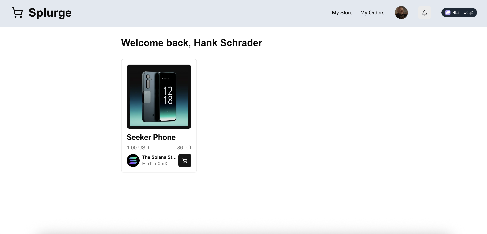

# Splurge



On-chain e-commerce platform for PRJ3223 Capstone Project 2, [Turbin3 Builders Cohort](https://turbin3.com/) and [School of Solana](https://ackee.xyz/school-of-solana).

[Live Website](https://splurge-psi.vercel.app/)

[Program on Solana Explorer](https://explorer.solana.com/address/SPLGn8gSbch6dmHL4Z4HBFc2kCbSpFUMxXZPF2XC3Nd?cluster=devnet)

[Source Repository](https://github.com/ChiefWoods/splurge)

## Features

- Manage store listings
- Track and fulfill orders
- Leave product reviews

## Built With

### Languages

- [](https://www.rust-lang.org/)
- [](https://www.typescriptlang.org/)
- [](https://react.dev/)

### Test Runner

- [](https://bun.sh/)

## Getting Started

### Prerequisites

1. Update your Solana CLI, avm and Bun toolkit to the latest version

```bash
agave-install init 2.1.0
avm use 0.31.1
bun upgrade
```

### Setup

1. Clone repository

```bash
git clone https://github.com/ChiefWoods/splurge.git
```

2. Configure to use localnet

```bash
solana config set -ul
```

3. In another terminal, start a local validator

```bash
solana-test-validator
```

4. Create and fund keypair

```bash
solana-keygen new -o splurge-wallet.json
solana airdrop 10 -k splurge-wallet.json
```

5. Install dependencies

```bash
bun i
```

6. Configure `.env` files

```bash
cp .env.example .env
```

#### Program

1. Resync your program id

```bash
anchor keys sync
```

2. Build program

```bash
anchor build
# Alternative build for running tests
# bun run build:test
```

3. Run tests

```bash
bun test
```

> [!NOTE]  
> Tests may fail with an `TypeError: Expected Buffer` error even with no code changes when bumping dependencies. Delete `node_modules`, `bun.lock`, reinstall dependencies and run tests again.

5. Deploy program

```bash
anchor deploy
```

6. Optionally initialize IDL

```bash
anchor idl init -f target/idl/splurge.json <PROGRAM_ID>
```

#### Sync IDL with App

IDL files in `/app` may need to be updated on every program build.

```bash
bun run idl:sync
```

#### Accounts

Initialize program accounts. Depending on the cluster used, you may be required to initialize your own stablecoin mints.

1. Configure `.env` files

```bash
cp .env.example .env
```

2. Run scripts

```bash
bun run scripts/instructions/initializeConfig.ts
```

### Tuktuk Automation

When an order is updated to `Shipping` status, it is scheduled as a task and will automatically be picked up by Tuktuk crank turners after 1 minute. This eliminates the need for manual order completion.

A public crank turner is relied on to run tasks, but you may optionally [set up your own crank turner](https://www.tuktuk.fun/docs/running-a-crank-turner) to ensure tasks don't go stale before being picked up.

```bash
bun run tuktuk
```

## Issues

View the [open issues](https://github.com/ChiefWoods/splurge/issues) for a full list of proposed features and known bugs.

## Acknowledgements

### Resources

- [Shields.io](https://shields.io/)
- [USDC Faucet](https://faucet.circle.com/)
- [PYUSD Faucet](https://faucet.paxos.com/)

### Hosting and API

- [Vercel](https://vercel.com/)
- [Helius](https://www.helius.dev/)
- [Dicebear](https://www.dicebear.com/)
- [Pyth](https://www.pyth.network/)

## Contact

[chii.yuen@hotmail.com](mailto:chii.yuen@hotmail.com)
